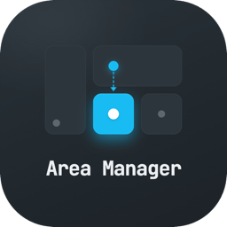
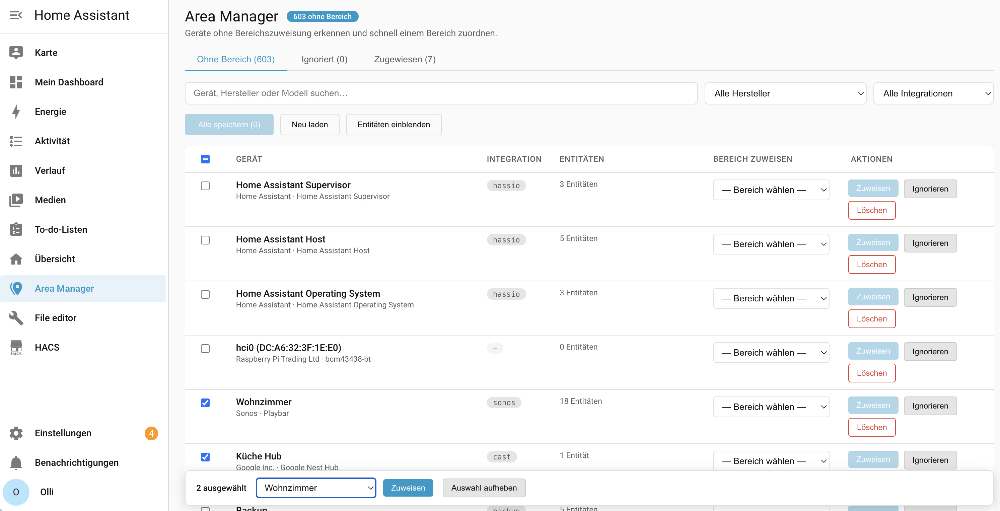

  

# Area Manager

A Home Assistant custom integration that adds a sidebar panel for finding devices without an area assignment and quickly assigning them — without navigating through multiple settings pages.

📺 [Watch the walkthrough video](https://www.youtube.com/watch?v=EiAQ1txMXbM) · 📝 [Read the blog post](https://smarterkram.de/10894/bereiche-in-home-assistant-nachtraeglich-zuweisen/) (both in German)

See [CHANGELOG.md](CHANGELOG.md) for release notes (English/Deutsch).

## Features

- **Overview** — lists all devices that have no area assigned yet
- **Quick assignment** — pick an area from a dropdown and assign per device or save all at once
- **Bulk assignment** — select multiple devices via checkbox and assign or ignore them all at once; selection is preserved while filtering
- **Assigned tab** — review devices that already have an area and correct misassignments, including unassigning back to "Without area"
- **Filter bar** — search by device name, manufacturer, or model; filter by manufacturer or integration domain
- **Device detail dialog** — click any row to open a detail popup with device info and its full entity list; rename the device, assign/reassign its area, ignore/restore it, or delete it, all without leaving the popup
- **Extended metadata** — see when a device was added and when it (or any of its entities) was last seen; expand per-entity details for state, last-seen timestamp, and all attributes
- **Ignore list** — mark devices that intentionally have no area (e.g. virtual or cloud-only devices); revisit and restore them at any time
- **Delete devices** — remove orphaned devices from the registry directly, with an inline confirmation step
- **Persistent ignore list** — ignored device IDs are stored in HA's `.storage` and survive restarts
- **i18n** — UI available in German and English, follows your HA language setting

## Requirements

- Home Assistant 2024.1 or newer
- [HACS](https://hacs.xyz/) installed

## Installation

### One-click (recommended)

Click the badge above to add this repository to HACS directly — it handles adding the custom repository and finding the integration for you. Then click **Download** and restart Home Assistant.

### Via HACS (manual)

1. Open HACS in your Home Assistant sidebar
2. Go to **⋮ → Custom repositories**
3. Add `https://github.com/olli-dot-dev/ha-area-manager` with category **Integration**
4. Find **Area Manager** in the HACS integration list and click **Download**
5. Restart Home Assistant

### Manual

1. Copy the `custom_components/area_manager` folder into your HA `config/custom_components/` directory
2. Restart Home Assistant

## Setup

After installation and restart:

1. Go to **Settings → Devices & Services → + Add Integration**
2. Search for **Area Manager** and click it
3. Confirm — no further configuration needed

The **Area Manager** entry appears in the sidebar immediately.

## Usage

### Assigning areas

| Step | Action |
|------|--------|
| 1 | Open **Area Manager** in the sidebar |
| 2 | Browse the list of devices without an area |
| 3 | Use the filter bar to narrow down by name, manufacturer, or integration |
| 4 | Select an area in the dropdown for one or more devices |
| 5 | Click **Assign** per row, or **Save all (n)** for all pending changes at once |

### Bulk assignment

Tick the checkbox on one or more rows (or the header checkbox to select all currently visible/filtered rows) to reveal a sticky bar at the bottom with an area dropdown, an **Assign** button, an **Ignore** button (on the "Without area" tab), and a **Clear selection** button. The selection is kept even while you change the filter, so you can filter, select, filter again, and select more before assigning or ignoring everyone at once. This works independently of — and alongside — the per-row dropdown.

### Reviewing already-assigned devices

Open the **Assigned** tab to see every device that already has an area. Each row's dropdown is pre-filled with its current area; the **Assign** button only activates once you actually pick a different value. Choose **"— No area —"** to unassign a device (it moves back to the **Without area** tab). The same filter bar and bulk-selection mechanic from the **Without area** tab are available here too.

### Device detail

Click anywhere on a row (outside buttons, checkboxes, and the dropdown) to open the device detail popup. It shows manufacturer, model, integration, current area, when the device was added, and a device-level "last seen" (the most recent activity across all of its entities). A **Go to device page** button navigates to HA's built-in device page.

From the same popup, without closing it, you can:
- **Rename** the device — click the pencil icon next to the title
- **Assign or reassign the area** — including unassigning a device back to "Without area"
- **Ignore it / show it again** — offered for devices without an area
- **Delete it** — with the same inline two-step confirmation used elsewhere

Click **Show details** to expand, per entity, its current state, last-seen timestamp, and all attributes in a compact table. If a "last seen" value is suspiciously close to the last Home Assistant restart, a note flags it — a restart alone refreshes that timestamp even if the device hasn't actually reported anything since, so the real last-seen time could be much older.

### Ignoring devices

Click **Ignore** on a row (or in the device detail popup) to move a device to the **Ignored** tab. Ignored devices are excluded from the unassigned list. Open the **Ignored** tab at any time — it has the same filter bar as the other tabs — and click **Show again** to restore a device.

### Deleting devices

Click **Delete** on a row (or in the device detail popup) to remove the device from the HA device registry. An inline confirmation appears before anything is deleted. Use this for truly orphaned devices that no longer have an active integration.

## Tabs

| Tab | Contents |
|-----|----------|
| **Without area (n)** | Devices with no area assigned and not ignored |
| **Ignored (n)** | Devices explicitly excluded from the unassigned list |
| **Assigned (n)** | Devices that already have an area, editable/correctable here |

## Supported languages

| Language | Code |
|----------|------|
| German | `de` |
| English | `en` (fallback) |

Pull requests for additional languages are welcome — add a block to `TRANSLATIONS` in `area-manager-panel.js` and a matching file in `translations/`.

## Contributing

1. Fork the repository
2. Drop `custom_components/area_manager` into your HA `config/custom_components/`
3. Restart Home Assistant after changes to any `.py` file — reloading the integration from Settings → Devices & Services is **not** enough, since a reload re-runs the already-imported module rather than re-reading it from disk. For JS-only changes, a hard-refresh of the browser is enough (the static path is served with `cache_headers=False`)
4. Open a pull request

## License

MIT
